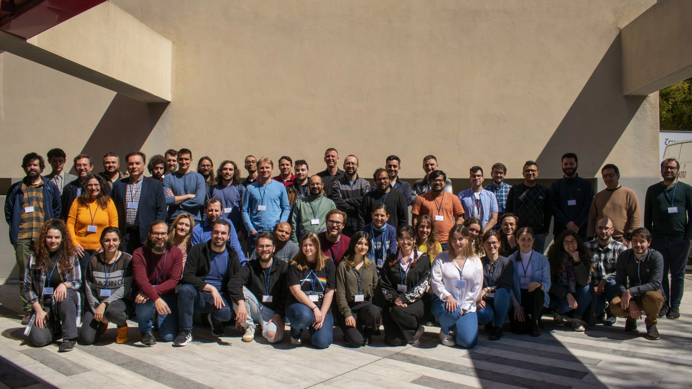

# [G2Net](https://www.g2net.eu/) - 4th Training School - A network for Gravitational Waves, Geophysics and Machine Learning (CA17137) 

Teaching material for the '[4th G2Net Training School - A network for Gravitational Waves, Geophysics and Machine Learning](https://indico.physics.auth.gr/event/14/)' held at the Aristotle University of Thessaloniki, Greece, 28-31 March 2023.

----

## TimeTable 

----

## Lecturers:
 
* Michal Bejger (Nicolaus Copernicus Astronomical Center)
* Isabel Cordero Carrión (Universitat de Valencia)
* Elena Cuoco (European Gravitational Observatory)
* Vladimir Ilic (Serbian Academy of Sciences and Arts)
* Dario Jozinović (ETH Zurich)
* Soumen Koley (Gran Sasso Science Institute)
* Natalia Korsakova (Astroparticule et Cosmologie, Paris)
* Paraskevi Nousi (Aristotle University of Thessaloniki)
* Kostas Papazachos (Aristotle University of Thessaloniki)
* Nikolaos Passalis (Aristotle University of Thessaloniki)
* Luigia Petre (Åbo Akademi University)
* Nikolaos Stergioulas (Aristotle University of Thessaloniki)
* Anastasios Tefas (Aristotle University of Thessaloniki)
* Agata Trovato (University of Trieste)

-----

## Teaching Material:

DAY-1 (Tuesday, March 28)

Agata Trovato
- Presentation: [Gravitational Wave (Open) Data](https://github.com/niksterg/g2net_4th_training_school_thessaloniki_2023/blob/main/DAY-1/Agata_Trovato/Trovato_GWdata.pdf)
- 1.1_Discovering_Open_Data 
- 1.2 Open_Data_access_with_GWpy.ipynb 
- 1.3 Q-transforms_with_GWpy.ipynb 
- 1.4 Generating_waveforms.ipynb 
- 2.2_Matched_Filtering_In_action.ipynb 
- 2.3_Signal_consistency_and_significance.ipynb 

DAY-2 (Wednesday, March 29)

Isabel Cordero-Carrión
- Visualization of short movie before session: [Patterns - Signals from the Universe](https://www.youtube.com/watch?v=bFgMgrE64rw&list=PLRQChI0vpMP7NKYbImJXsvNtIF-C_tj-l&index=2)
- Send by email (isabel.cordero@uv.es) until the end of Thursday March 30th your script for a 5 minutes long monologue / video. You are not requested to do the monologue or the video, JUST THE SCRIPT. Don't forget to include authors of the script.

Nikolaos Stergioulas
- Surrogate models 

DAY-3 (Thursday, March 30)

[Hackathon on Kaggle!](https://www.kaggle.com/competitions/g2net-hackathon/overview/description) 
