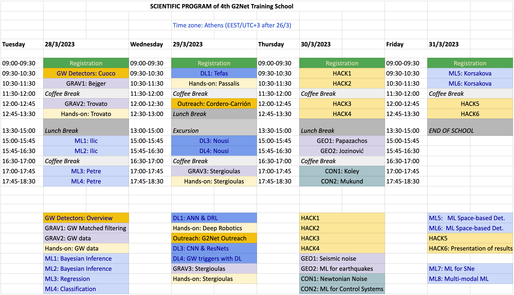

# [G2Net](https://www.g2net.eu/) - 4th Training School - A network for Gravitational Waves, Geophysics and Machine Learning (CA17137) 

Teaching material for the '[4th G2Net Training School - A network for Gravitational Waves, Geophysics and Machine Learning](https://indico.physics.auth.gr/event/14/)' held at the Aristotle University of Thessaloniki, Greece, 28-31 March 2023.

----

## TimeTable 

