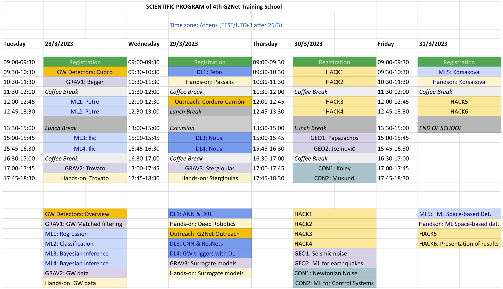

# [G2Net](https://www.g2net.eu/) - 4th Training School - A network for Gravitational Waves, Geophysics and Machine Learning (CA17137) 

Teaching material for the '[4th G2Net Training School - A network for Gravitational Waves, Geophysics and Machine Learning](https://indico.physics.auth.gr/event/14/)' held at the Aristotle University of Thessaloniki, Greece, 28-31 March 2023.

----

## TimeTable 

----

## Lecturers:
 
* Michal Bejger (Nicolaus Copernicus Astronomical Center)
* Isabel Cordero Carrión (Universitat de les Illes Balears)
* Elena Cuoco (European Gravitational Observatory)
* Vladimir Ilic (Serbian Academy of Sciences and Arts)
* Dario Jozinović (ETH Zurich)
* Soumen Koley (Gran Sasso Science Institute)
* Natalia Korsakova (Astroparticule et Cosmologie, Paris)
* Paraskevi Nousi (Aristotle University of Thessaloniki)
* Kostas Papazachos (Aristotle University of Thessaloniki)
* Nikolaos Passalis (Aristotle University of Thessaloniki)
* Luigia Petre (Åbo Akademi University)
* Nikolaos Stergioulas (Aristotle University of Thessaloniki)
* Anastasios Tefas (Aristotle University of Thessaloniki)
* Agata Trovato (University of Trieste)

-----

## Teaching Material:

DAY-1 (Tuesday, March 28)

Agata Trovato
- 1.1_Discovering_Open_Data 
